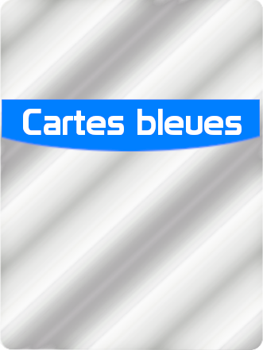
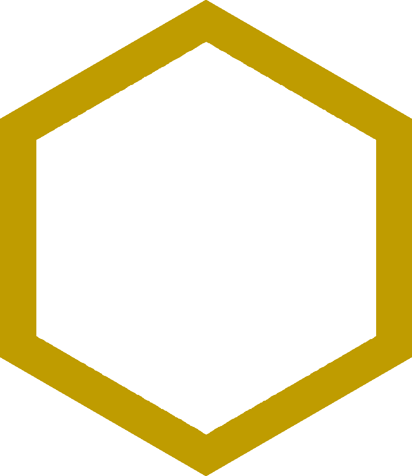

# PLT : Terraforming Mars

## Présentation du jeu :

**Leader d’une corporation :**

Dans Terraforming Mars, vous dirigez une corporation se lançant dans différents projets, représentés par les cartes que vous achetez et que vous jouez. Ces projets contribuent le plus souvent (directement ou indirectement) au processus de terraformation de la planète, mais ils peuvent aussi concerner d’autres aspects de la gestion de votre corporation.

## Règles du jeu :

**Pour gagner la partie :**

Il vous faudra atteindre un haut **Niveau de Terraformation (NT)** et obtenir de nombreux **Points de Victoire (PV)**.

**Augmenter son NT (Niveau de Terraformation) :**

Votre NT augmente chaque fois que vous parvenez a augmenter l’un des trois paramètres globaux **(température, oxygène, océans)**. Votre NT détermine votre revenu de base mais également votre score de base. A mesure que le processus de terraformation avance, davantage de projets deviennent réalisables. Des PV additionnels vous sont octroyés lorsque vous contribuerez à étendre l’emprise de l’Humanité sur le système solaire, en fondant des cités, en construisant des infrastructures ou en protégeant l’environnement.

**De générations en générations :**

Le temps se mesure en générations. Chaque génération commence par la phase d’Ordre du Tour, suivi de la phase de Recherche, au cours de laquelle chaque joueur accède à de nouvelles cartes. Pendant la phase d’actions, les joueurs peuvent, à tour de rôle, réaliser 1 ou 2 actions, jusqu’à ce qu’ils aient tous décidé de passer.
Débute alors la phase de Production, pendant laquelle chaque joueur produit des ressources (conformément aux paramètres de son plateau individuel) et reçoit son revenu (basé principalement sur son NT).

**Plateau de jeu :**

Le plateau central permet de suivre l’évolution de la température, du taux d’oxygène, des niveaux de terraformation de chaque joueur ainsi que la succession des générations. Sur la carte principale représentant la planète, vous pouvez ajouter des tuiles Océan, des tuiles Forêt ou des tuiles Cité à mesure que la partie avance. On trouve aussi sur le plateau une liste des projets standards (réalisables par tous les joueurs), ainsi que le détail des récompenses et des objectifs que les joueurs vont se disputer.

**Fin de partie :**

Lorsque les trois paramètres globaux (océans, température et oxygène) ont atteint leur but.

En clair,la partie se termine lorsqu'il y a :

- suffisamment d’oxygène dans l’air (14%),

- assez d’océans pour reconstituer une météorologie proche de celle de la Terre (9),

- une température supportable ( +8°C).

Lorsque ces trois conditions sont remplies, la partie s'arrête à la fin de la génération en cours.

**Vainqueur :**

Le joueur qui aura accumulé le plus de Points de Victoire pendant toute la partie sera déclaré vainqueur.
Les Points de Victoire proviennent :

- de votre Niveau de Terraformation,

- de vos tuiles sur le plateau,

- des récompenses obtenues,

- des objectifs validés,

- mais aussi directement des cartes que vous aurez jouées.

### Les 3 paramètres globaux :

**Les 3 paramètres globaux (PG) :**

- La température,

- L’oxygène,

- Les océans.

À chaque fois que vous augmentez l’un de ces paramètres, votre Niveau de Terraformation augmente proportionnellement, vous permettant d’améliorer votre revenu et votre score.

**Level Max :** 

Lorsqu’un paramètre global a atteint son niveau optimal, il ne peut pas aller au-delà, et l’augmenter ne vous permettra plus d’améliorer votre NT. Vous pourrez continuer à jouer des cartes ou réaliser des actions qui augmentent un paramètre, mais cela n’aura plus d’effet sur votre NT.

### Les tuiles :

Le plateau de jeu représente une carte de la planète, sur laquelle les **tuiles** doivent être placées. Lorsque vous placez une tuile, vous devez respecter les **contraintes de placement**. Certaines zones sont réservées aux tuiles Océan ou à des cités spécifiques, aucune autre tuile ne pourra donc y être placée (sauf indication contraire). De plus, une tuile peut comporter certaines restrictions de placement, précisées éventuellement sur les cartes que vous jouez ou ci-dessous dans le descriptif des tuiles.

Lorsque vous placez une tuile, vous recevez immédiatement le **bonus de placement** indiqué sur la zone que vous recouvrez (s’il y en a un). Vous recevez aussi un bonus en plaçant une tuile près d’une tuile Océan (voir ci-dessous).

**Tuiles Océan : Les tuiles Océan ne peuvent être placées que sur les zones qui leur sont réservées** (zones bleues du plateau).

- (+1NT) : Placer une tuile Océan augmente votre NT de 1 niveau (c’est un paramètre global).

- Les tuiles Océan ne sont la propriété de personne.

- Chaque tuile Océan sur le plateau procure un bonus de placement de 2 M€ à chaque joueur qui placera une tuile sur une zone adjacente (même s’il s’agit d’une autre tuile Océan).

**Tuiles Forêt : Si possible, les tuiles Forêt doivent être placées à côté d’une autre tuile que vous possédez.**

- Si aucune zone n’est disponible autour de vos tuiles, ou si vous n’avez pas encore placé de tuile sur le plateau, vous pouvez placer la tuile Forêt sur n’importe quelle zone disponible.

- La tuile que vous avez placé vous appartient.
**Lorsque vous placez une tuile Forêt, vous augmentez le niveau d’oxygène, si possible (et par conséquent votre NT, car l’oxygène est un paramètre global). Si vous ne pouvez pas augmenter le niveau d’oxygène, vous n’augmentez pas non plus votre NT.**

- A la fin de la partie, les tuiles Forêt valent 1 PV et procurent 1 PV à chaque cité adjacente (voir ci-dessous).

**Tuiles Cité : Les tuiles Cité ne peuvent pas être placées à côté d’une autre tuile Cité** (exception : **Noctis Ville** doit toujours être placée sur la zone qui lui est réservée).

- La tuile que vous avez placé vous appartient.

- A la fin de la partie, chaque tuile Cité rapporte 1 PV pour chaque tuile Forêt adjacente (peu importe son propriétaire).
(Remarque : la carte **Capitale** permet de placer l’unique tuile Capitale. Elle est considérée comme une tuile Cité normale pour le décompte des PV, mais procure également un bonus lié aux tuiles Océan adjacentes, comme indiqué sur la carte.)

**Tuiles Spéciales :** Certaines cartes permettent de placer des tuiles spéciales. Les restrictions de placement et les effets spécifiques sont indiqués sur les cartes. N’oubliez pas de placer un cube de votre couleur sur la tuile.

### Les ressources :

Chaque joueur possèdes des ressources et une production pour chacune des ressources. Au début de la partie, chaque joueur commence avec un niveau de NT égal à 20.

1. **MegaCrédits (M€) :** Ils sont utilisés pour jouer des cartes, entre autres choses. **Remarque : Votre revenu est égal à la somme de votre production de M€ et de votre NT.** La production de M€ est la seule production qui peut être négative, mais elle ne pourra jamais descendre en dessous de -5.

2. **Acier :** Il n’est utilisé que pour payer les cartes qui possèdent un badge Construction, et vaut 2 M€ par cube. Vous pouvez combiner des M€ et de l’acier pour payer le coût d’une carte, mais on ne vous fait jamais « la monnaie» si vous surpayez une carte avec de l’acier.

3. **Titane :** Le titane fonctionne comme l’acier, sauf qu’il vaut 3 M€ par cube et n’est utilisé que pour payer les cartes qui possèdent un badge Espace.

4. **Plantes :** Les plantes peuvent être converties en tuile Forêt grâce à l’action correspondante (8 plantes pour une tuile Forêt).

5. **Énergie :** L’énergie est utilisée par de nombreuses cartes. **Toute l’énergie non utilisée est convertie en chaleur au début de la phase de production.**

6. **Chaleur :** La chaleur peut être convertie pour augmenter la température de 1, grâce à l’action correspondante (8 chaleurs pour une augmentation de 2°C).

### Cartes :

Chaque joueur commence la partie avec une carte **Corporation**. Pendant la partie, les joueurs achètent et jouent des cartes **Projet** qui procurent des avantages de différents types. Les cartes peuvent être des cartes Action (bleues), des cartes Instantanées (vertes) ou de cartes Evènement (rouges).

1. **Badges :** Les badges indiquent la catégorie de la carte. Ils permettent à la carte d’affecter ou d’être affectée par d’autres cartes, ou par le plateau individuel du joueur (par exemple, une carte avec le badge Construction peut être payée avec de l’acier).

2. **Action / Effet :** Les cadres marqués d’un ruban bleu présentent un effet permanent ou une action spéciale qui peut être utilisé pendant la partie. Ces actions spéciales ne peuvent être effectuées qu’une seule fois par génération, alors que les effets permanents sont toujours actifs.

3. **Coût :** Le coût à payer pour jouer la carte depuis votre main. Pour prendre des cartes en main, vous devez tout d’abord les acheter pendant la phase de recherche.

4. **Prérequis :** Tout prérequis doit être rempli pour pouvoir jouer la carte. Certaines cartes nécessitent qu’un paramètre global ait atteint un certain niveau, alors que d’autres ne pourront être jouées que si un paramètre est encore bas. Certaines cartes vous demandent de posséder un certain nombre de badges ou un certain niveau de production. *Remarque : Pour pouvoir jouer une carte, il faut aussi que vous soyez capable d’en réaliser les effets.* Les prérequis ne doivent être atteints qu’au moment où vous jouez la carte, pas lorsque vous l’utiliserez plus tard.

5. **Effets immédiats :** La plupart des cartes affectent vos ressources (ou celle de vos adversaires) ou votre niveau de production. Elles peuvent également avoir d’autres effets, comme la possibilité de placer une tuile.

6. **PV :** Certaines cartes vous procurent des Points de Victoire à la fin de la partie. Si vous n’êtes pas certains de l’effet d’une carte, lisez son texte entre parenthèses.

### Début de partie : 

Cette section décrit la mise en place d’une partie standard pour 2 à 5 joueurs.

1. **Joueurs :** Chaque joueur commence la partie avec un niveau de production de 1 pour chaque ressource (parties standards uniquement) et avec un niveau de NT égal à 20.

2. **Cartes Corporation :** Les joueurs commencent la partie avec une carte corporation indiquant les ressources et production initiales supplémentaires. Elles peuvent également donner une action à réaliser et/ou un effet passif permanent. Chaque joueur doit choisir entre trois cartes corporation au début de la partie.

3. **Cartes projet :** Chaque joueur doit choisir parmi 10 cartes projet celles qu'il veut garder dans sa main.**Chaque carte qu'il conserve lui coûte 3M€.**

### Phases d'un tour (Génération) :

Chaque génération se décompose en trois phases :

- Phase de recherche

- Phase d'actions

- Phase de production

Le joueur qui joue en premier change à chaque génération.

1. **Phase de recherche :** Chaque joueur pioche 4 cartes Projet et décide combien de cartes il souhaite acheter et conserver en main. Chaque carte coûte 3 M€ et vous pouvez acheter de 0 à 4 cartes. Il n’y a pas de limite au nombre de cartes en main. Cette phase n’est pas réalisée pour la première génération.

2. **Phase d'actions :** A chaque fois que revient leur tour de jouer, les joueurs réalisent 1 ou 2 actions, ou décident de passer. Le jeu se déroule ainsi, jusqu’à ce que tous les joueurs aient passé. Les actions peuvent être combinées de toutes les façons, selon le choix du joueur dont c’est le tour de jouer. **A votre tour, vous pouvez choisir de réaliser 1 ou 2 actions. Si vous ne réalisez pas d’action, vous passez et vous ne pouvez plus participer à la phase d’Actions de cette génération. Lorsque tout le monde a passé, la phase d’Actions est terminée.** Les actions possibles sont les suivantes :
	1. **Jouer une carte de sa main**
	2. **Réliser un projet standard** 
	3. **Utiliser l'action d'une carte action**
	4. **Convertir des plantes en tuile Forêt**
	5. **Convertir la chaleur en température**

3. **Phase de production :** Tous les joueurs réalisent cette phase simultanément. Premièrement, toute l’énergie est convertie en chaleur (déplacez tous les cubes Ressource de la zone Énergie à la zone Chaleur de votre plateau individuel). Ensuite, tous les joueurs reçoivent leurs nouvelles ressources. Les joueurs reçoivent des M€ pour un total équivalent à la somme de leur Niveau de Terraformation et de leur production de M€ (qui peut être négative !). Ils reçoivent ensuite toutes les ressources qu’Us produisent, selon les niveaux indiqués par leur plateau individuel. Toutes les ressources produites sont placées dans les cadres correspondants. 

## Architecture et classes utilisées :

Certaines constantes utilisées dans notre programme sont définies dans le fichier constants.hpp.

## State :

Dans le diagramme de classes du state, nous avons défini les différents objets permettant de définir l'état du jeu à un instant t.

1. **Player :** Le joueur ainsi que les ressources qu'il possède et les cartes qu'il a en main.
2.  **GlobalParameters :** Les paramètres globaux qui doivent atteindre leurs objectifs pour finir la partie.
3.   **Board :** Les tuiles placées et les joueurs les ayants placés.
4.    **State :** Regroupe les précédentes données. Il s'agit de la classe qui va instancier toutes les autres classes du state.
5.    **RenderAPI :** Communique les informations du state au Render pour afficher ce qui est nécessaire.

Cette dernière classe, **RenderAPI** est un peu particulière. En effet, elle est directement reliée à la scene du render, et elle propose une interface de données pour que la scene puisse les afficher en temps réel. Chaque classe du state possède une fonction **map<string, string> serializeUiData()** qui va récupérer ses données, les transformer en map de string puis les retourner au lanceur de la fonction. Cela permet au RenderAPI de pouvoir mettre à jour ses données grâce à un simple appel de cette fonction.

Les données sont sous la forme suivante :

- Player : [   "resource i" : "amount", idCardBoard i" : "id", "badge i" : "badge, amount", idCardHand i" : "id" ]
- Board : [ "x, y" : "type, idOwner" ]
- GlobalParameters : [    "Oxygen" : "amount" , "Temperature" : "temperature", "NumberOceans" : "numberOceans" ]

Cette API propose alors 4 fonctions pour permettre au render de mettre à jour l'affichage :
- **providePlayerData**
- **provideBoardData**
- **provideGlobalParametersData**
- **provideScoreData**

## Render :

#### Résumé :

Le render contient toutes les classes nécessaire à l'affichage.
1. **Text :** Composant de base contenant un texte.
2. **Image :** Composant de base contenant un sprite et une texture.
3. **Button :** Composant de base contenant une image et une zone cliquable.
4. **TexturePool :** Interface permettant de n'instancier qu'une seule fois les textures. Tous les sprites utilisants la même texture pointent vers la même.
5. **StdProjectDisplay :** Regroupe les éléments pour le menu des projets standards.
6.  **PopupCard :** Une fenêtre qui contient des cartes. Elle s'affiche par dessus le plateau.
7.   **PopupBadge :** Une fenêtre listant le nombre de badges possédés.
8.   **PopupPay :** Une fenêtre pour permettre à l'utilisateur de payer.
9.   **PlayerScoreDisplay :** Les niveaux de terraformations de chacun des joueurs et la compagnie à laquelle ils appartiennent.
10.   **BoardDisplay :** Le plateau de jeu et les tuiles placées.
11.   **MenuDisplay :** Le menu avec les ressources, les cartes en mains, les badges possédées et le nombre de point de victoire du joueur en cours.
12.   **BaseScene :** Classe abstraite d'où sont dérivées les objets scene qui contiennent les classes citées précédemment.
13. **SceneManager** : Gère l'affichage des différentes scènes.
14. **EventHandler** : Gère les évènements liés à la fenêtre windows, les clics par exemple.
15. **SharedContext** Simple classe qui fournit une référence vers le sceneManager et l'EventManager. Elle est utile pour les boutons.
 
##### Architecture :
Notre architecture ici repose sur le principe de composition : nous créons des éléments de base, ici **Texte**, **Image** et **Button** qui dérivent de **sf::Drawable** pour autoriser la syntaxe **window.draw(Image)** qui est très pratique et très logique, à condition d'override la fonction **draw**.
Nous composons des "gros blocs" qui obéissent à leur propre logique. L'affichage du plateau de jeu est géré par une classe, tandis que l'affichage des cartes est géré par une autre.
Enfin, ces "gros blocs" composent des classes de haut niveau, les **Scene**, qui vont être gérées par le **SceneManager**.

##### Textures :
Nous nous sommes vites aperçus que notre jeu consommait beaucoup de mémoire lorsque beaucoup d'éléments étaient présents à l'écran. C'est parce que pour chaque Image, même si elles utilisaient la même texture, nous la rechargions en mémoire.
Nous avons donc crée une classe **TexturePool** par laquelle passe toute instanciation de texture. Cette dernière garde une map dont la clé est le chemin vers la ressource, et la valeur est un pointeur vers cette ressource. Si on demande une texture qui a déjà été créée, alors celui-ci retourne un pointeur vers la texture déjà existante. Si elle n'existe pas, alors elle est chargée et ajoutée à la map. Nous avons réduit l'utilisation de la RAM de 500 Mo à 30 Mo.

##### Liste des composants :
Nous avons ensuite décidé de créer une classe pour chaque "bloc" d'éléments présents sur l'écran, chacun obéissant à leur propre logique. Ils sont donc tous composés de **shared_ptr** vers des composants de base. Ces **shared_ptr** ont 2 intêrets :
- Il est maintenant possible de les stocker dans une grande liste que nous avons nommé **listComponents** qui est en réalité un **vector\<shared_ptr\<sf::Drawable\>\>**. Nous avons donc *downcast* les composants de base en drawable, ce qui permet d'avoir accès à une fonction **draw** extrêmement pratique et propre :
  ```C++
	for(const auto& drawable : this->listComponents){
		window.draw(*drawable);
	}
  ```
- Comme les éléments de **listComponents** sont directement rattachés au composant via un shared_ptr, lorsqu'on agit directement sur le composant, l'affichage est automatiquement mis à jour.

##### SceneManager :
La classe **SceneManager** nous permet d'avoir un contrôle très haut niveau de l'affichage à l'écran. Elle a des méthodes publiques *setScene(sceneID)*, *removeScene()*, *update()* qui permettent de facilement ajouter et retirer des éléments à l'écran.

L'affichage des scènes se fait via un sytème de stack (pile) d'objets **Scene**. Le **SceneManager** va stocker toutes les scènes actives dans une stack, et va les afficher à l'écran suivant l'ordre dans la pile. Le premier élément (tout en haut) sera dessiné en dernier pour être au dessus de toutes les autres scènes à l'écran. Chaque scène possède un attribut booléen *transparent*. Si il vaut *True*, cela veut dire qu'il faut afficher la scène qu'il y a en dessous dans la pile, si il vaut *False*, alors il ne faut ne pas afficher les éléments en dessous. Le **SceneManager** va donc chercher la première scene qui n'est pas transparente dans la pile, et va afficher toutes les scènes qui sont au dessus. Cela permet de revenir facilement au menu précédent, car nous avons beaucoup de fenêtres contextuelles, comme les cartes ou les badges.

La gestion des évènements est déléguée au **EventHandler**, mais il faut savoir que uniquement les boutons de la scène la plus en haut dans la stack sont actifs.

le **SceneManager** va aussi s'occuper de récupérer les données nécessaires à chaque coup d'*update()* via le **RenderAPI**.

##### Affichage des tuiles :
On remarque très vite une chose atypique par rapport au plateau : il est composé de tuiles hexagonales. Il est donc difficile de se repérer avec les coordonnées classiques cartésiennes. Pour résoudre ce problème, nous avons tout simplement défini notre propre repère et nos propres coordonnées :


Nous avons l'axe des abscisses classique mais l'axe des ordonnées est en biais. Quelques coordonnées sont affichées pour mieux saisir le fonctionnement.
Ensuite, en utilisant la taille d'un sprite, le centre du plateau ainsi que les coordonnées dans notre repère, il est possible d'afficher les tuiles au bon endroit.

##### Mise à jour de l'affichage

L'affichage est mis à jour avec les valeurs du state lors de l'appel de la fonction **sceneManager.update()**. Cette fonction va chercher les données (sous forme de map de string) depuis le renderAPI, puis va décomposer les messages reçus pour les envoyer à chaque bloc d'affichage. On remarquera que seules les données du joueur concerné sont transmises par ces messages (mis à part les NT), ce qui veut dire que le jeu est sécurisé.

Chaque bloc va ensuite interpréter différement leurs données. Par exemple, le menu des ressources en bas va simplement changer le texte en fonction du nombre de resources du joueur. Le plateau lui va récupérer les coordonnées de chaque tuile (si il y en a une nouvelle) et les ajouter à la liste des tuiles à afficher. Les paramètres à gauche eux vont modifier la région de la texture qui est affichée en fonction des paramètres, pour créer cet effet de jauge qui se remplit.

##### EventHandler
Les évènements sont délégués à cette classe. Elle va principalement gérer les clics de souris.
Elle propose des méthodes publiques comme *handleEvent(sf::Event)* ou bien *loadButtons(vector\<Button>)*. Cette dernière est appelée à chaque fois qu'un changement de scène est effectué, car il faut charger les boutons de la nouvelle scène.

A chaque fois que des nouveaux boutons vont être enregistrés, elle va créer une liste de hitbox pour chaque boutons, qui va être parcourue lorsqu'il y a un clic. Cette liste est beaucoup plus rapide et simple à parcourir qu'une liste d'objets boutons. Comme il s'agit d'une liste de sf::FloatRect, nous pouvons utiliser directement la méthode FloatRect.contains(Vector2f) qui est surement optimisée. Si un clic est effectué sur un bouton actif, alors sa fonction *onClick(sharedContext)* est appelée.

##### Boutons
Le fonctionnement des boutons repose sur le principe des lambdas. Chaque bouton à un attribut *onClickFunction* qui est un objet de type fonction qui ne retourne rien et qui prend en paramètre un sharedContext. Ils ont une méthode *onClick(sharedContext)* qui finalement, ne fait qu'appeler la fonction *onClickFunction*. Il est possible de modifier cette fonction via la méthode *setOnClickFunction()*. Cette méthode nous permet de programmer presque tout ce que nous voulons sur un bouton, du moment que c'est accessible par le sharedContext.

Voici un exemple basique de syntaxe pour créer un bouton qui ferme la scène :
```C++
closeButton = Button("closeButton.png", {420, 320});
closeButton.setOnClickFunction([](const SharedContext& s) {
	s.getSceneManager.removeScene();
});
```

Il suffit ensuite d'appeler la fonction *onClick(SharedContext)* lorsque l'utilisateur clique sur le bouton. 

## Images utilisées :

### Fond d'écran :

Cette image est celle qui sert de fond d'écran pour notre jeu.


Sur ce fond d'écran viennent se rajouter ceux des menus :





### Badges :

Ces images sont utilisées pour indiquer les badges sur les cartes.


### Ressources :

Ces images sont utilisées pour illustrer les ressources et/ou leurs productions.  La production d'une ressource est réalisée en superposant l'image d'une production sur le fond production. L'image de mégacrédit est vide et nécessite de rajouter un texte par dessus pour définir la valeur de la ressource ou du coût.


### Tuiles :

L'image d'astéroïde suivante est ajoutée sur l'arrière plan du jeu et délimite un emplacement réservé pour une tuile spéciale :


Les images suivantes représentes les différentes tuiles pouvant être placées au cours d'une partie. La dernière est utilisée comme base pour générer les tuiles spéciales :


Lorsque ces tuiles sont posées par un joueur on ajoute un cadre de la couleur du joueur autour d'elles. Les cadres pouvant être utilisés sont les suivants :





### Cartes et paramètres globaux :

L'image suivante représente le dos d'une carte :


Voici un exemple de carte pouvant être utilisées:


L'image suivante est utilisée comme fond sur lequel est inscrit les points de victoire d'une carte :


Les images suivantes sont celles représentant les paramètres globaux oxygène et température :


On ajoute également une jauge pour la température et pour l'oxygène grâce aux images suivantes :


## Moteur de jeu
Comme le jeu Terraforming Mars fonctionne avec des cartes qui modifient les règles du jeu, nous avons pensé le moteur avec un seul mot en tête : **modularité**. Nous avons donc passé énormément de temps à conceptualiser le moteur de jeu (malheureusement un peu trop) avant de commencer à le coder.

### Event manager
Il est centré autour d'une classe EventManager. Toutes les classes du state et du render communique avec l'engine via des objets de type EventDetails, qui sont des wrapper d'une map<string,int>. Cet EventManager, sur reception de ces évènements, va les interpréter. Les types d'évènements sont stockés dans une énumération. L'EventManager va alors appeler les éléments du moteur de jeu qui sont concernés par l'évènement en question, et déléguer le travail à ceux-ci. 

### Card reader
Toutes les informations des cartes sont contenues dans un grand fichier json, il contient le coût de la carte, ses badges, les effets, les conditions pour la jouer etc...
Dans tout le jeu, les cartes ne sont finalement désignées que par des id uniques, de 0 à 160. Par exemple, chaque sprite de carte s'appelle "carte_\<id>.png", et le render ne connait que l'id des cartes de chaque joueur pour mettre à jour l'affichage correctement.
Cependant, il faut bien récupérer les informations de la carte comme le coût, les badges, et surtout les effets, et les transformer en donnée utilisable par le reste du jeu. Pour cela, nous avons utilisé la librairie jsoncpp, qui permet de parcourir un fichier json de manière très efficace.
Voila un exemple d'une carte dans notre fichier.
```json
{
"id": 4,
"cost": 16,
"badges": ["PLANT"],
"effects": [
["Instant","ModifyResource","2","PLANT_PROD"],
["Instant","ModifyResource","2","GOLD_PROD"],
["Instant","ModifyResource","2","PLANT"],
["Instant","ModifyResource","2","PV"]
],
"condition": ["minTemp",4]
},
```
Dans les effets, "Instant" indique qu'il s'agit d'un effet à appliquer au moment de jouer la carte, "ModifyResource" indique le type d'effet à appliquer, le chiffre après représente la quantité de ressource à modifier, et "PLANT_PROD" signifie qu'il faut modifier la production de plante du joueur qui a joué la carte.

La classe CardReader a une méthode publique *parseCard(int idCard)* qui va collecter les données sur l'id de la carte demandée. Elle va ensuite mettre à disposition ses variables membres (read-only via des getters) pour récolter les informations nécessaires, comme *vector\<state::Badge> **listBadges***, *int **cost***, *vector\<reaction> **instantReactions*** etc... 
Elle a aussi une méthode *parseCardInfo(int idCard)* qui est plus légère et qui va seulement lire le coût et la liste des badges.

### Reaction
Les actions possibles avec les cartes sont très nombreuses, mais nous avons remarqué qu'elles gravitent autour des mêmes réactions de base, plus petite. Nous avons donc décidé de décomposer les effets compliqués en effets simples, et nous avons décidé de les implémenter en suivant le patron de conception commande. Nous avons implémenté 4 commandes très récurrentes dans les cartes : l'ajout/retrait de ressources, la pioche, placer une tuile et augmenter les paramètres globaux.

Ce modèle nous aura été très utile, car nous pouvions à présent composer les cartes que nous voulions. Toutes les commandes héritent d'une classe abstraite nommée *Reaction*, qui contient 3 méthode virtuelles pures : *execute()*, *query()* et *procNotification()*.
- La méthode *execute()* est très explicite, elle permet d'appliquer l'effet de manière permanente au state.
- La méthode *query()* quant à elle va tester la faisabilité de la commande. Par exemple, elle va demander le plateau de jeu si il est possible de placer cette tuile à un endroit particulier. Si tout va bien, elle renvoie un string vide, sinon elle renvoie un string non vide avec des informations sur l'erreur. Cela est pratique pour débugger, mais ça pourrait aussi être utile pour donner plus d'informations au joueur.
- Enfin la méthode *procNotification()* est un peu spéciale. Elle va demander au concerné de faire passer le message comme quoi l'action a été jouée, mais sans modifier le state, car c'est la méthode *execute()* qui s'en occupe. C'est ce mécanisme qui est responsable des réactions en chaîne. Nous avons séparé les 2 méthodes pour pouvoir arrêter une réaction en chaîne si une condition n'est pas respectée à un moment. Si *execute()* s'occupait aussi de provoquer les réactions en chaîne, alors il ne serait pas possible d'annuler l'opération précédente, et le state serait modifié alors qu'il ne devrait pas. Ces notifications servent à activer les observateurs qui représentent des effets passifs.

Ces réactions sont créées de manière générale par le CardReader au moment de la lecture de la carte, puis elles sont mises à disposition via l'attribut *vector\<reaction> **instantReactions*** par exemple. Dans le jeu, tout est *Reaction*. Payer la carte est une réaction, placer une tuile est une réaction, l'augmentation de l'oxygène lorsqu'on place une forêt est une réaction aussi.

Pour gérer les effets en cascade, nous avons mis en place 2 systèmes :
- Une queue de réactions, qui vont s'exécuter uniquement si elles sont toutes valides. Si il y en a une seule de mauvaise, la queue est détruite et les réactions ne sont pas exécutées. Elles sont ensuite appelées dans l'ordre dans lequel elles ont été ajoutées dans la liste. La gestion de cette queue de réactions se fait dans l'Event manager
- Des observateurs d'évènement, qui vont réagir lorsqu'ils vont recevoir une certaine notification. Par réagir, tester la faisabilité des réactions, activer les notifications correspondantes puis les placer dans la queue.

Normalement, aucune situation dans le jeu ne peut mener à des réactions en boucle.

Les réactions vont garder leurs données nécessaires comme la valeur de la réaction, quels joueurs elles doivent affecter etc... en tant qu'attributs, et ces données sont passées au moment de la création de la réaction dans le constructeur.

### Observateur
Dans le jeu sont présents beaucoup d'effets passifs. Un moyen très commun de coder ce genre d'effets est d'utiliser des observateurs. Les nôtres dérivent un peu de ce modèle, mais s'appuie globalement sur la même idée.

Les éléments principaux du state (**Player**, **GlobalParameters** et **Board**) sont dotés d'une référence vers une classe nommée **EventSender**. Cette classe contient une référence vers l'EventManager. Les éléments du state vont pouvoir envoyer des notifications au moteur, pour qu'il puisse agir en conséquence. Par exemple, lorsqu'une tuile est posée sur le plateau, la classe **Board** va envoyer une notification de la sorte. Lors de la réception, l'EventManager s'aperçoit qu'un évènement "TILE_PLACED" a été généré. Il va alors avertir tous les *tilePlacedListeners* que telle tuile a été placée à tel endroit.

Les listeners (observateurs) héritent tous de la classe abstraite *Listener*, qui va contenir la méthode virtuelle pure *onNotify(eventDetails)*. Cette méthode va exécuter ou non le code présent dans le Listener en fonction des détails qui sont reçus. Par exemple, l'augmentation de l'oxygen se fait uniquement si la tuile placée est une forêt.

L'ajout de listeners directement dans le code fonctionne (augmentation de l'oxygène), cependant, nous n'avons pas eu le temps d'implémenter un ajout dynamique qui se ferait en jouant des cartes qui ont des effets passifs (les cartes bleues). Cependant, avec notre architecture, l'ajout serait possible.

# Conclusion
Beaucoup d'erreurs stratégiques ont été commises durant ce projet, et ce chez tous les membres du groupe et à tous les niveaux. Cependant, ce projet trop ambitieux et un peu maladroit nous aura appris énormément de choses :
- Aborder une problème compliqué en le décomposant en tâches simples, et reconnaître les design patterns qui correspondent à une certaine situation. Comme c'était notre première fois qu'on était confronté à ce genre de notions, nous avons mis énormément de temps à arriver avec une solution architecturale correcte.
- Coder en environnement imposé (ici avec les headers générés par dia2code). En entreprise, on aura un environnement de développement auquel il va falloir s'adapter.
- Acquérir une connaissance poussée du C++ : smart_pointers, move semantics, lambdas etc...

Malheureusement, nous n'avons pas eu le résultat escompté à cause de :
- Une arrivée trop tardive de l'architecture.
- Une propriété du code individuelle trop importante : on ne savait pas trop comment le code des autres fonctionnait, donc il était difficile voire impossible de travailler en collaboration sur la partie d'un autre.
- Une importance trop élevée qui a été accordée au rendu du jeu.
- Une volonté de rédiger du code trop "propre", avec un design avec beaucoup de classes, qui a considérablement ralenti notre vitesse de développement. 
- L'ambition de recréer une copie la plus fidèle possible du jeu de base, qui est très très complexe.

Les principales leçons que nous avons retenues de ce périple sont :
- Avoir tout le temps un code qui fonctionne en rédigeant un prototype puis en ajoutant les fonctionnalités au fur et à mesure.
- Rédiger plus de tests.
- Passer plus de temps à analyser nos codes les uns les autres.

Finalement, même si le jeu n'est pas abouti, nous sommes très fiers du travail que nous avons pu produire, ce projet nous aura enseigné (de manière très brutale certes) de nombreuses compétences qui nous seront extrêmement utiles tout au long de notre carrière.

[](https://github.com/cbares/plt/actions)
